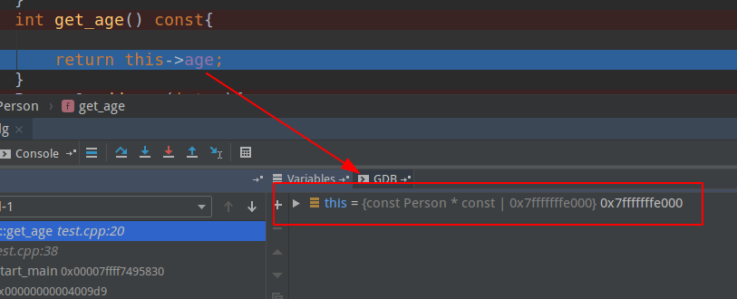

# this指针那些事

## 关于作者

微信公众号：


## 1.this指针

相信在坐的很多人，都在学Python，对于Python来说有self，类比到C++中就是this指针，那么下面一起来深入分析this指针在类中的使用！

首先来谈谈this指针的用处：

（1）一个对象的this指针并不是对象本身的一部分，不会影响sizeof(对象)的结果。

（2）this作用域是在类内部，当在类的非静态成员函数中访问类的非静态成员的时候，编译器会自动将对象本身的地址作为一个隐含参数传递给函数。也就是说，即使你没有写上this指针，编译器在编译的时候也是加上this的，它作为非静态成员函数的隐含形参，对各成员的访问均通过this进行。

其次，this指针的使用：

（1）在类的非静态成员函数中返回类对象本身的时候，直接使用 return *this。

（2）当参数与成员变量名相同时，如this->n = n （不能写成n = n)。

另外，在网上大家会看到this会被编译器解析成`A *const `，`A const * `，究竟是哪一个呢？下面通过断点调试分析：

现有如下例子：

```c++
#include<iostream>
#include<cstring>


using namespace std;
class Person{
public:
    typedef enum {
        BOY = 0, 
        GIRL 
    }SexType;
    Person(char *n, int a,SexType s){
        name=new char[strlen(n)+1];
        strcpy(name,n);
        age=a;
        sex=s;
    }
    int get_age() const{
    
        return this->age; 
    }
    Person& add_age(int a){
        age+=a;
        return *this; 
    }
    ~Person(){
        delete [] name;
    }
private:
    char * name;
    int age;
    SexType sex;
};


int main(){
    Person p("zhangsan",20,Person::BOY); 
    cout<<p.get_age()<<endl;
	cout<<p.add_age(10).get_age()<<endl;
    return 0;
}
```

对于这个简单的程序，相信大家没得问题吧，就是定义了一个类，然后初始化构造函数，并获取这个人的年龄，设置后，再获取！

为了验证this指针是哪一个，现在在`add_age`处添加断点，运行后如下：


会发现编译器自动为我们加上`A* const`，而不是`A const *this`！

紧接着，上述还有个常函数，那么我们在对`get_age`添加断点，如下：



会发现编译器把上述的this，变为`const A* const`，这个大家也能想到，因为这个函数是const函数，那么针对const函数，它只能访问const变量与const函数，不能修改其他变量的值，所以需要一个this指向不能修改的变量，那就是`const A*`,又由于本身this是`const`指针，所以就为`const A* const`!

总结：this在成员函数的开始执行前构造，在成员的执行结束后清除。上述的get_age函数会被解析成`get_age(const A * const this)`,`add_age`函数会被解析成`add_age(A* const this,int a)`。在C++中类和结构是只有一个区别的：类的成员默认是private，而结构是public。this是类的指针，如果换成结构，那this就是结构的指针了。
