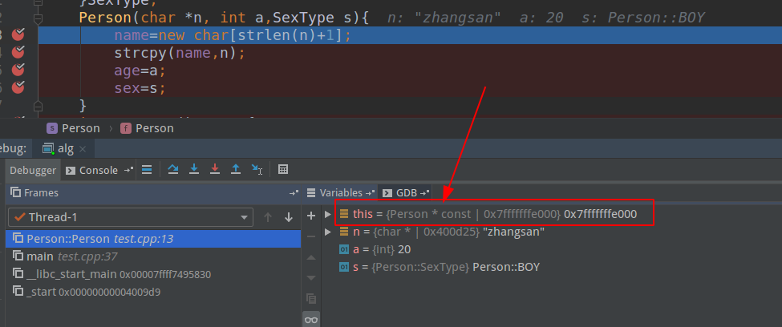
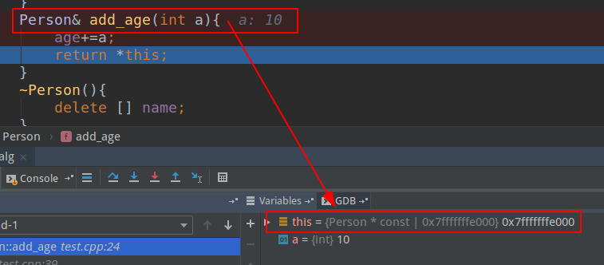

# Story about this

## About Author


## 1.This pointer

I believe that many people sitting here are learning python. For Python, there is self. Analogy to C + + is this pointer. Let's analyze the use of this pointer in class.

Let's first talk about the use of this pointer：

（1）This pointer to an object is not part of the object itself and does not affect the result of sizeof.

（2）This scope is within the class. When accessing the non static members of the class in the non static member function of the class, the compiler will automatically pass the address of the object itself to the function as an implicit parameter. That is to say, even if you don't write this pointer, the compiler will add this when compiling. As the implicit formal parameter of non static member function, the access to each member is carried out through this.

Second, the use of this pointer:

（1）When the class object itself is returned in a class's non static member function, directly use return *this。

（2）When the parameter is the same as the member variable name, 如this->n = n （不能写成n = n)。


The following examples are available:

```c++
#include<iostream>
#include<cstring>


using namespace std;
class Person{
public:
    typedef enum {
        BOY = 0, 
        GIRL 
    }SexType;
    Person(char *n, int a,SexType s){
        name=new char[strlen(n)+1];
        strcpy(name,n);
        age=a;
        sex=s;
    }
    int get_age() const{
    
        return this->age; 
    }
    Person& add_age(int a){
        age+=a;
        return *this; 
    }
    ~Person(){
        delete [] name;
    }
private:
    char * name;
    int age;
    SexType sex;
};


int main(){
    Person p("zhangsan",20,Person::BOY); 
    cout<<p.get_age()<<endl;
	cout<<p.add_age(10).get_age()<<endl;
    return 0;
}
```


In order to verify which this pointer is, now in 'Add'_ Add a breakpoint at "age". After running, it is as follows ：





You'll find that the compiler adds it to us automatically `A* const`，rather than `A const *this`！

Closely.There is also a constant function above，so we try to add a breakpoint at`get_age` as following：


You'll find that the compiler takes the this，then it changed to`const A* const`. Because this is the const function，It can only access const variables and const functions

，You cannot modify the values of other variables. So you need a this to point to a variable that cannot be modified，that is `const A*`,and because this is`const` pointer.
Conclusion：This is constructed before the start of member function execution. Clear after member execution. Get above_ The age function is resolved to `get_age(const A * const this)`,`add_age`function will be paresed as `add_age(A* const this,int a)`. In C + +, there is only one difference between a class and a structure: the member of a class is private by default, while the structure is public. This is the pointer of the class. If it is replaced by a structure, this is the pointer of the structure.
