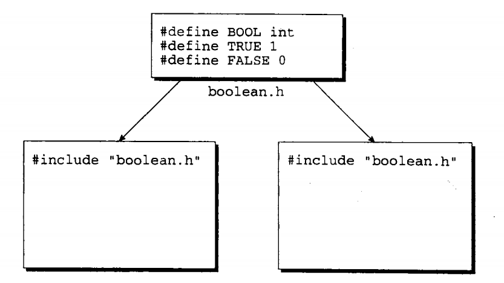
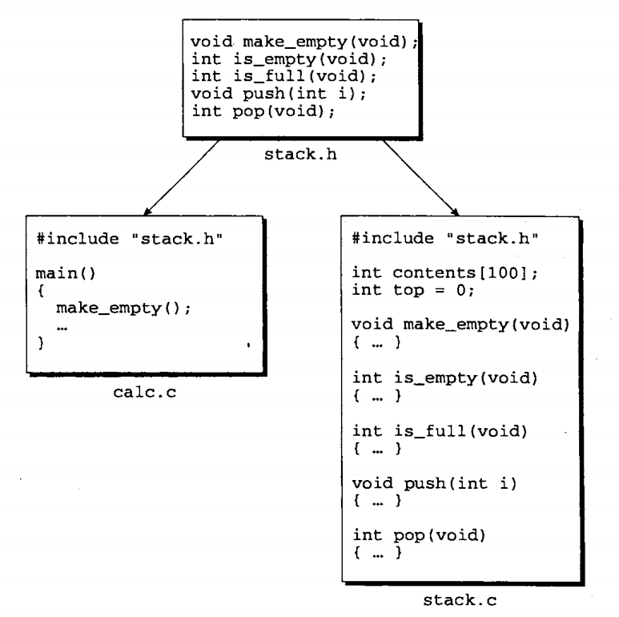

# 第十五章 编写大规模程序

源文件包含函数的定义和外部变量，而头文件包含可以在源文件之间共享的信息。

---

## 源文件

可以把程序分割成一定数量的源文件，源文件的扩展名为`.c`。源文件主要包含函数的定义和变量。其中一个源文件必须包含名为 main 的函数，作为程序的起始点。

把程序分成多个源文件有许多显著的优点：

- 把相关的函数和变量集合在单独一个文件中可以帮助明了程序的结构。

- 可以单独对每一个源文件进行编译。如果程序规模很大而且需要频繁改变的话，这种方法可以极大地节约时间。

- 利于复用。

## 头文件

当把程序分割成几个源文件时，问题也随之产生：某文件的函数如何能调用定义在其他文件中的函数？函数如何能访问其他文件中的外部变量？两个文件如何能共享同一个宏定义或类型定义？答案取决于`#include`指令。

`#include`指令告诉预处理器打开指定的文件，并且把此文件的内容插入到当前文件中。这种打开的文件称为头文件，其扩展名为`.h`。

### include 指令

`#include`指令有两种书写格式：

- `#include <文件名>` 搜索系统头文件所在目录，比如在 UNIX 系统中，通常是在 /usr/include

- `#include "文件名"` 搜索当前目录，然后搜索系统目录

利用加上诸如-I这样的命令行选项可以添加搜索头文件的位置。

### 共享宏定义和类型定义

大规模的程序包含用于几个源文件共享的宏定义和类型定义，这些定义应该放在头文件中。

比如下图的例子：



有两个源文件包含了 boolean.h

把宏定义和类型定义放到头文件中有如下的好处：

1. 不必把定义复制到需要的源文件，节约时间。

2. 程序变得更加容易修改，改变定义只需要改变头文件。

3. 不用担心源文件包含了相同的宏或类型而其定义不同。

### 共享函数原型

没有原型依赖的函数调用是很危险的，编译器的假设可能是错误的。当调用定义在其他文件中的函数时，要始终确保编译器在调用之前看到函数f的原型。

解决办法就是把函数的原型放进头文件中，然后在所有调用函数f的地方包含头文件。

其包含的方式可能如图所示：



### 共享变量的声明

变量可以在文件中共享。

为了声明变量而不定义，需要在变量声明的开始处放置关键字 extern :

```c
/* in heaeder file */
extern int i;
```

为了共享i，需要在一个源文件中定义i:

```c
/* in source file */
int i;
```

### 保护头文件

如果一个源文件同时包含一个头文件两次，那么可能产生编译错误（比如包含了两次相同的类型定义）。

因此要用到一种保护头文件的方法：

```c
#ifndef BOOLEAN_H
#define BOOLEAN_H

/*
 real content
*/

#endif
```

如果再次包含此头文件，预处理器就不会再扩展真实的内容。

### 头文件中的#error指令

经常把#error指令放置在头文件中是用来检查不应该包含头文件的条件。例如：

```c
#ifndef DOS
#error Graphics supported only under DOS
#endif
```

如果非DOS的程序试图包含此头文件，那么编译将在#error指令处终止。

## 构建多文件程序

构建大程序的基本步骤：

- 编译，必须对每一个源文件进行编译。不需要编译头文件。编译器产生一个文件，此文件包含来自源文件的目标代码，称为目标文件（object file）。

- 链接，链接器把目标文件和库文件结合在一起生成一个可执行程序。

大多数编译器允许用单独一步来构建程序：

```c
cc -m fmt fmt.c line.c word.c
```

### makefile

使用 makefile 更易于构建大型程序。 makefile 列出了作为程序的部分文件，并描述了它们之间的依赖性。

更多讨论见书本。

!!!note "my note"
	一种自动生成依赖性的说明的方法是键入命令：`gcc -MM *.c`

### 在程序外定义宏

大多数 UNIX 编译器支持-D选项，允许在命令行指定一个宏定义：

```c
cc -DDEBUG=1 foo.c
```

定义了宏 Debug ，在 foo.c 程序中，且值为1。如同在 foo.c 中的开始出现：

```c
#define DEBUG 1
```