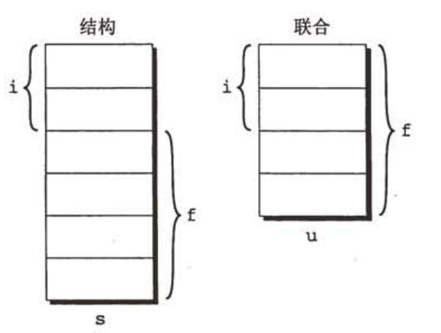

# 第十六章 结构、联合和枚举

---

## 结构变量

结构的元素可能具有不同的类型，而且，每个成员都有名字。

### 结构变量的声明

一个声明结构变量的例子：

```c
struct {
    int number;
    char name[NAME_LEN + 1];
    int on_hand;
} part1, part2;
```

每个结构变量都有三个成员：number, name, on_hand 。

`struct {...}`指明了类型，而 part1 和 part2 则是具有这种类型的变量。

结构的成员在内存中是按照声明的顺序存储的。第一个声明的变量放在存储位置的最前面。

每个结构表示一种新的名字空间（ name space ）。 part1 的 number 和 part2 的 number 不会有冲突。

### 结构变量的初始化

结构变量可以在声明的同时进行初始化：

```c
struct {
    int number;
    char name[NAME_LEN + 1];
    int on_hand;
} part1 = { 528, "Disk drive", 10 },
  part2 = { 914, "Printer cable", 5 };
```

结构初始化式的表达式必须是常量。初始化式可以短于它所初始化的结构，这样任何“剩余”成员都用0作为它的初始值。

### 对结构的操作

为了访问结构内的成员，首先写出结构的名字，然后写出成员的名字：

```c
printf("Part number: %d\n", part1.number);
```

结构成员的值是左值：

```c
part1.number = 258;
```

用于访问结构成员的句点是一个运算符，其优先级比较高：

```c
/* &计算的是 part1.on_hand 的地址 */
scanf("%d", &part1.on_hand);
```

另一种主要的结构操作是赋值运算：

```c
part2 = part1;
/* 现在 par1 和 part2 每个成员的值都一样 */
```

可以用结构来复制数组：

```c
struct { int a[10]; } a1, a2;
a1 = a2;
```

运算符=仅仅用于类型一致的结构。

## 结构类型

如果在两个地方编写了：

```c
struct {
    int number;
    char name[NAME_LEN + 1];
    int on_hand;
} part1;

struct {
    int number;
    char name[NAME_LEN + 1];
    int on_hand;
} part2;
```

那么 part1 和 part2 就不是同一个类型，这样就不能执行赋值操作。为了解决这个问题，需要为表示结构的类型定义名字。方法有两种：

- 使用结构标记

- 使用 typedef 定义类型名

### 结构标记的声明

结构标记（ structure tag ）即：

```c
struct part {
    int number;
    char name[NAME_LEN + 1];
    int on_hand;
};

/* 用标记 part 声明变量 */
struct part part1, part2;
```

### 结构类型的定义

即：

```c
typedef struct {
    int number;
    char name[NAME_LEN + 1];
    int on_hand;
} Part;

/* 声明变量 */
Part part1, part2;
```

## 联合

联合（ union ）也是由一个或多个成员构成的，而且这些成员可能具有不同的数据类型。但是，编译器只为联合中最大的成员分配足够的内存空间，联合的成员在这个空间内彼此覆盖。

对于：

```c
union {
    int i;
    float f;
} u;

struct {
    int i;
    float f;
} s;
```

他们的存储如：



其中 u.i 和 u.f 具有相同的地址。

## 枚举

枚举（ enumeration ）是一种由程序员列出的值，而且程序员必须为每种值命名（枚举常量）：

```c
enum { CLUBS, DIAMONDS, HEARTS, SPADES } s1, s2;
```

虽然枚举和结构没什么共同的地方，但是它们的声明方式很类似。

枚举常量的名字必须不同于闭合作用域内声明的其他标识符。

### 枚举标记和枚举类型

为了定义枚举标记，可以写成：

```c
enum suit { CLUBS, DIAMONDS, HEARTS, SPADES };

/* 声明枚举变量 */
enum suit s1, s2;
```

用 typedef 给枚举命名：

```c
typedef enum { CLUBS, DIAMONDS, HEARTS, SPADES } Suit;

/* 声明枚举变量 */
Suit s1, s2;
```

### 枚举作为整数

在系统内部，C语言会把枚举变量和常量作为整数来处理。枚举常量的值可以是任意整数：

```c
enum suit { CLUBS = 1, DIAMONDS = 2, HEARTS = 3, SPADES = 4 };
```

两个或多个枚举常量具有相同的值甚至也是合法的。

当没有为枚举常量指定值时，它的值是一个大于前一个常量的值的值（大1）。默认第一个枚举常量的值为0。